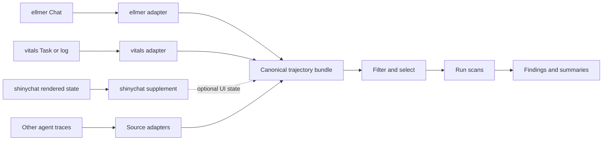

# Trajectory concept map

## Status and scope

This document maps the trajectory concepts exposed by inspect_scout, ellmer,
vitals, and shinychat. It recommends the boundary and vocabulary for the first
canonical scans trajectory contract. It is design input for issue #4, not a
commitment to exact R class names or function signatures.

The intended audience is package developers and coding agents working on
scans. The source review used the upstream snapshots listed in
[Source snapshots](#source-snapshots). The approach was approved by the
maintainer on 2026-08-22 and is the baseline for issue #4.

## Decision summary

The v0 contract should describe completed, post-run trajectory snapshots. It
should not execute agents, score task outcomes, reproduce a chat UI, or ingest
live streams.

The canonical object should be source-neutral and relational, with four tidy
tables:

1. `trajectories`: one row per logical agent path.
2. `turns`: one row per role-scoped message container.
3. `events`: one row per typed content block or non-message execution event.
4. `evaluations`: zero or more outcome judgments linked to a trajectory.

This split preserves the semantic structure of ellmer, the outcome data from
vitals, the richer event model that motivates inspect_scout, and future
multi-agent traces. A nullable `run_id` groups trajectories that belong to the
same larger execution without requiring a separate run table in v0.

Scans are diagnostics over this canonical object. Evaluation scores are inputs
that provide outcome context. A score is not a scan finding, and a scan is not
a second evaluation framework.

## Product boundary



The solid path contains semantic records that an agent or evaluator produced.
The dotted shinychat path contains optional presentation state. Renderer-only
content must not silently become model-visible trajectory content.

## Shared vocabulary

| Term | Definition |
|---|---|
| Run | A producer-defined execution boundary. One run may contain one or more trajectories. |
| Trajectory | The ordered observable record of one logical agent attempt or path through a run. |
| Round | A user input plus the assistant and tool-result turns produced in response. This is a useful derived view, not a required storage primitive. |
| Turn | A role-scoped message container such as a system, user, assistant, or tool-result turn. |
| Content | A typed payload within a turn, such as text, thinking, an image, a tool request, or a tool result. |
| Event | The smallest ordered observable record retained by scans. Turn contents become events; execution traces may also contribute events that do not belong to a turn. |
| Tool call | An event requesting a named tool invocation with arguments and a correlation identifier. |
| Tool result | An event containing the value or error produced for a tool call, linked by the call identifier. |
| Evaluation | An outcome judgment associated with a trajectory, usually with task, sample, epoch, scorer, target, and score context. |
| Scan | A versioned diagnostic applied after execution to selected trajectories, turns, or events. |
| Finding | One result emitted by a scan, with a value and references to the trajectory records that support it. |
| Source | The upstream object, file, or store from which an adapter created the canonical snapshot. |

`Transcript` is treated as an upstream or serialized representation of a
trajectory. scans should use `trajectory` in its public vocabulary so the
contract also fits in-memory ellmer chats and multi-agent traces.

## Source concept map

| scans concept | inspect_scout | ellmer | vitals | shinychat |
|---|---|---|---|---|
| Run | Eval or source identity in `TranscriptInfo`; separate scan-job identity in `ScanSpec` | No explicit run object | Eval-log `run_id` | Conversation or Shiny session, depending on the app |
| Trajectory | `Transcript` | One `Chat` history | One sample and epoch's `solver_chat` | The ellmer client history; a history record may contain branches |
| Turn | Inspect `ChatMessage` | `Turn` subclasses | Turns retained inside `solver_chat` and `scorer_chat` | Rendered message is an approximate UI counterpart |
| Content | Message content | `Content` subclasses | Serialized in log messages and reconstructed by `vitals_log_read()` | Rendered message segments, attachments, and HTML dependencies |
| Event | `Event` and `Timeline` | No general event stream; content and turn metadata provide observable records | Inspect-compatible sample events | UI settle points, server status/error state, and history nodes |
| Tool call/result | Tool messages and tool events | `ContentToolRequest` and `ContentToolResult` joined by request ID | Preserved in logs and reconstructed chats | Rich tool cards are rendered from ellmer content |
| Evaluation | Transcript score/success metadata | None | Task sample score, target, scorer, and metrics | None |
| Scan | `Scanner` execution in a `ScanJob` | None | A scorer evaluates outcomes but is not a trajectory scan | None |
| Finding | `Result` inside a `ResultReport` | None | Score rows are evaluation results, not findings | None |

The main naming hazard is the word *run*. In inspect_scout, the analyzed agent
execution and the later scan job both have identities. scans should reserve
`run_id` for the producer execution and use `scan_id` for a diagnostic run.

## Source-shape inventory

### inspect_scout

inspect_scout separates transcript selection, scanner execution, and result
persistence.

- `TranscriptInfo` holds trajectory identity, source provenance, task/sample
  context, agent/model context, outcome, counts, termination state, and
  source-specific metadata.
- `Transcript` adds messages, events, and hierarchical timelines.
- `Transcripts` provides immutable `where()`, `limit()`, `shuffle()`, and
  `order_by()` selection plus readers and snapshots.
- A scanner declares the message, event, or timeline content it needs. Its
  input may be a whole transcript, one or more messages, one or more events, or
  one or more timelines.
- `Result` carries an arbitrary value, optional label, answer, explanation,
  metadata, and message/event references. `ResultReport` adds scanner input,
  validation, scan errors, scan-time events, and model usage.
- `ScanSpec`, `Status`, and `Summary` separate reproducibility metadata and
  aggregate status from individual findings. Results are stored per scanner
  with one row per finding by default.

The useful design pattern is separation of concerns, not a direct port of the
Python runtime. scans can initially adopt a smaller synchronous R surface while
preserving provenance, typed findings, and references.

### ellmer

ellmer provides the strongest semantic source model for v0.

- `Chat$get_turns()` returns the completed conversation history and
  `Chat$get_rounds()` provides a derived view that groups tool loops with their
  initiating user input.
- `UserTurn`, `SystemTurn`, and `AssistantTurn` contain ordered `Content`
  objects. `AssistantTurn` additionally exposes provider JSON, token counts,
  cost, duration, and finish reason. `AssistantPartialTurn` records an
  interrupted response and its reason.
- Content classes distinguish text, thinking, citations, images, PDFs, tool
  requests, and tool results. A tool request has an ID, name, arguments, and
  provider-specific extras. A tool result points back to its request and holds
  either a value or an error.

A sanitized tool-loop shape is:

```text
UserTurn
  ContentText
AssistantTurn [tokens, cost, duration, finish_reason = "tool_use"]
  ContentThinking
  ContentToolRequest [id = "call_1", name, arguments]
UserTurn
  ContentToolResult [request id = "call_1", value or error]
AssistantTurn [finish_reason = "success"]
  ContentText
```

ellmer does not assign public IDs or timestamps to ordinary turns and content
blocks. An adapter must therefore assign snapshot-local IDs from their ordinal
positions. Provider JSON can contain useful details but is inconsistent and
potentially sensitive, so it should be excluded by default or retained only in
explicit, sanitized metadata.

### vitals

vitals adds task and outcome context around ellmer chats.

- `Task$get_samples()` returns a tibble built from dataset rows. Each row has a
  unique `id`; repeated evaluations add `epoch`. Solving adds `result` and
  `solver_chat`; scoring adds `score` and may add `scorer_chat` and metadata.
- `Task$log()` writes Inspect-compatible logs containing top-level run/task
  identity and per-sample input, target, messages, output, scores, events,
  usage, and attachments.
- `vitals_log_read()` returns `id`, `epoch`, `input`, `target`, `result`,
  `score`, and a reconstructed `solver_chat`, plus `scorer_chat` when present.
  It restores text, thinking, images, tool requests/results, token usage,
  duration, and finish reason where the log contains them.

A normalized vitals sample should create one trajectory for each `(sample_id,
epoch)` pair. Its `solver_chat` supplies turns and events, while its target,
score, and scorer context become evaluation rows.

The public `vitals_log_read()` result does not include the log's top-level
`run_id` or `task_id`, even though those values are present in the persisted
format. The initial adapter must either use a public vitals source that exposes
those identifiers, parse the documented Inspect-compatible log shape, or mark
them unavailable. It must not reach into a live `Task` object's private R6
fields.

### shinychat

shinychat has both semantic and rendered state. The semantic source remains the
ellmer `Chat` used by `chat_server()`.

Additional post-run or settled state includes:

- `input$ID_messages`, a read-only list of rendered messages. Each message has
  `role` and ordered `segments` with `content` and `content_type`, plus optional
  HTML dependencies and attachments.
- The object returned by `chat_server()`, including reactive `last_input`,
  `last_turn`, `status`, `last_error`, and the current client.
- Conversation history records with conversation identity, title, timestamps,
  client information, a node graph, an active leaf, recorded ellmer turns,
  rendered UI messages, and optional application state.

Rendered messages can contain arbitrary HTML or Shiny UI and can differ from
what the model saw. They should be attached as optional view metadata or a
future presentation table, never substituted for ellmer turns. Conversation
branching is valuable future input, but v0 may select the active path and
preserve conversation/node identifiers in metadata.

## Proposed v0 trajectory contract

The exact R constructor and validation API belongs in issue #4. The contract
should nevertheless guarantee the following table roles and fields.

### `trajectories`

One row per logical agent trajectory.

| Field | Requirement | Meaning |
|---|---|---|
| `trajectory_id` | required character | Unique identity within the canonical object. |
| `run_id` | optional character | Producer execution identity shared by related trajectories. |
| `parent_trajectory_id` | optional character | Parent path for delegated or nested agents. |
| `source_type` | required character | Adapter/source vocabulary such as `ellmer`, `vitals`, or `shinychat`. |
| `source_id` | optional character | Upstream identity when one exists. |
| `source_uri` | optional character | File or store locator with secrets removed. |
| `task_id`, `sample_id`, `epoch` | optional | Evaluation coordinates. |
| `agent`, `model` | optional character | Primary agent/model labels. |
| `started_at`, `completed_at` | optional datetime | Known execution bounds. |
| `status`, `error` | optional character | Completion or termination state. |
| `metadata` | required list-column | Sanitized source-specific data not promoted to stable fields. |

For a plain ellmer chat, `run_id` may equal `trajectory_id`. For multi-agent
sources, several trajectory rows may share a run ID and use
`parent_trajectory_id` to retain delegation structure.

### `turns`

One row per semantic message container.

| Field | Requirement | Meaning |
|---|---|---|
| `trajectory_id`, `turn_id` | required character | Parent trajectory and snapshot-local turn identity. |
| `turn_index` | required integer | Total order within the trajectory. |
| `round_index` | optional integer | Derived conversational round. |
| `role` | required character | `system`, `user`, `assistant`, `tool`, or a source extension. |
| `input_tokens`, `output_tokens`, `cached_input_tokens` | optional numeric | Assistant usage when available. |
| `cost`, `duration` | optional numeric | Assistant cost and elapsed seconds. |
| `finish_reason`, `status`, `error` | optional character | Completion information. |
| `metadata` | required list-column | Sanitized turn-specific extras. |

### `events`

One row per ordered content block or execution event.

| Field | Requirement | Meaning |
|---|---|---|
| `trajectory_id`, `event_id` | required character | Parent trajectory and snapshot-local event identity. |
| `event_index` | required integer | Total order across retained events. |
| `turn_id`, `content_index` | optional | Turn membership and order within that turn. |
| `parent_event_id` | optional character | Containment or causal parent for spans and nested events. |
| `event_type` | required character | Stable kind such as `content`, `tool_call`, `tool_result`, `error`, or `custom`. |
| `content_type` | optional character | Text, thinking, citation, image, PDF, or a source extension. |
| `name`, `call_id` | optional character | Tool/event name and correlation ID. |
| `text` | optional character | Searchable textual representation when appropriate. |
| `value` | required list-column | Typed payload, including `NULL` when absent. |
| `timestamp`, `duration`, `status`, `error` | optional | Event execution state. |
| `metadata` | required list-column | Sanitized source-specific extras. |

Tool calls and results must retain the same `call_id`. Binary or very large
content should be represented by a safe reference and metadata rather than
duplicated inline by default.

### `evaluations`

Zero or more rows per trajectory.

| Field | Requirement | Meaning |
|---|---|---|
| `trajectory_id`, `evaluation_id` | required character | Join key and evaluation identity. |
| `task_id`, `sample_id`, `epoch` | optional | Evaluation coordinates. |
| `scorer` | optional character | Scorer or judge identity. |
| `value`, `target` | required list-columns | Outcome and expected value or grading guidance. |
| `explanation` | optional character | Scorer rationale when available. |
| `metadata` | required list-column | Metrics, scorer model, or other source context. |

The adapter must create the evaluation-to-trajectory join explicitly. Matching
later by prompt text, row order, or model output is not acceptable.

## Adapter rules

1. Adapters consume public upstream APIs wherever possible.
2. Adapters snapshot mutable objects; the canonical result does not retain a
   live `Chat`, reactive, R6 controller, connection, or provider client.
3. IDs supplied by a source are preserved. Missing turn/event IDs are created
   deterministically from the trajectory ID and ordinal positions within the
   snapshot.
4. Ordering is explicit. List order alone is not the contract.
5. Missing timestamps and usage remain missing; adapters do not invent them.
6. Tool errors are normalized to serializable class/message data while the
   source condition is excluded by default.
7. Unknown content and events are retained as typed extensions with their
   sanitized payload, rather than silently dropped or coerced to text.
8. Secrets, authorization headers, raw credentials, and unbounded binary data
   are never copied into metadata.
9. Source-specific columns live in `metadata` until at least two integrations
   demonstrate that they are stable shared concepts.

## Scan and finding boundary

A future scan function should declare whether it consumes whole trajectories,
turns, or events. It should return zero or more findings with:

- `finding_id`, `scan_id`, scan name, and scan version;
- `trajectory_id` and referenced `turn_id` or `event_id` values;
- an arbitrary typed value plus optional label, explanation, and metadata;
- a structured scan error when analysis fails; and
- scan-time usage separately from the agent trajectory's usage.

This follows inspect_scout's useful distinction between source execution,
scanner input, result, reference, validation, and scan-time model usage. Scan
orchestration, concurrency, persistence, validation sets, and a viewer are
deliberately outside the v0 trajectory contract.

## Gaps and risks

| Gap or risk | v0 treatment |
|---|---|
| ellmer turns lack public IDs and timestamps | Generate snapshot-local ordinal IDs; allow missing timestamps. |
| Mutable chats can be edited or reset | Adapters return detached, validated snapshots and document that regenerated IDs describe that snapshot. |
| Provider JSON is inconsistent and may be sensitive | Exclude by default; permit explicit sanitized retention. |
| vitals does not expose persisted run/task IDs through `vitals_log_read()` | Preserve IDs when available without private R6 access; otherwise record the gap. |
| shinychat rendered state can diverge from model-visible state | Keep it optional and presentation-scoped. |
| shinychat history can branch | Select the active path in v0 and retain branch identifiers for a later branch-aware contract. |
| Images, PDFs, attachments, and tool output can be large | Store safe references or bounded summaries by default. |
| Multi-agent traces may be hierarchical rather than linear | Reserve run, parent trajectory, and parent event identities now. |
| Streaming produces partial states | Accept completed snapshots; preserve an interrupted status but do not ingest live deltas. |
| Arbitrary metadata can prevent stable serialization | Require list-columns with validation and sanitization rules in issue #4. |

## Maintainer decisions for issue #4

The next contract issue should decide:

1. The exported constructor and class names for the four-table bundle.
2. Whether `trajectory_id` is unique per object or globally namespaced by
   source.
3. The required event-type and content-type vocabularies and extension rules.
4. The deterministic ID scheme for sources without IDs.
5. Whether the first vitals adapter accepts only evaluated `Task` objects,
   persisted logs, or both.
6. Whether active-path shinychat history is a v0 adapter or a later extension.
7. The default redaction and size limits for provider JSON, binary content,
   attachments, and tool output.

## Source snapshots

Research was performed on 2026-08-22 against these upstream commits:

| Project | Version | Commit |
|---|---|---|
| inspect_scout | Development snapshot | [`63b481d64db14b98fb476b0071827f1d41b3c96d`](https://github.com/meridianlabs-ai/inspect_scout/tree/63b481d64db14b98fb476b0071827f1d41b3c96d) |
| ellmer | 0.4.2.9000 | [`19be478ebf1a2e5d2db96a8aeaca71592c8d3f26`](https://github.com/tidyverse/ellmer/tree/19be478ebf1a2e5d2db96a8aeaca71592c8d3f26) |
| vitals | 0.3.0.9001 | [`e1ad045bbaf846a9e4fdda651f4892017f4a85d0`](https://github.com/tidyverse/vitals/tree/e1ad045bbaf846a9e4fdda651f4892017f4a85d0) |
| shinychat | 0.4.0.9000 | [`c6121f15192472d058241a9ad987d1b35a84dbbc`](https://github.com/posit-dev/shinychat/tree/c6121f15192472d058241a9ad987d1b35a84dbbc) |

## Code reference index

| Project | Source path | Key symbols |
|---|---|---|
| inspect_scout | [`src/inspect_scout/_transcript/types.py`](https://github.com/meridianlabs-ai/inspect_scout/blob/63b481d64db14b98fb476b0071827f1d41b3c96d/src/inspect_scout/_transcript/types.py) | `TranscriptInfo`, `Transcript`, `TranscriptContent` |
| inspect_scout | [`src/inspect_scout/_transcript/transcripts.py`](https://github.com/meridianlabs-ai/inspect_scout/blob/63b481d64db14b98fb476b0071827f1d41b3c96d/src/inspect_scout/_transcript/transcripts.py) | `Transcripts`, `TranscriptsReader`, `ScannerWork` |
| inspect_scout | [`src/inspect_scout/_scanner/scanner.py`](https://github.com/meridianlabs-ai/inspect_scout/blob/63b481d64db14b98fb476b0071827f1d41b3c96d/src/inspect_scout/_scanner/scanner.py) | `Scanner`, `scanner`, `ScannerConfig` |
| inspect_scout | [`src/inspect_scout/_scanner/result.py`](https://github.com/meridianlabs-ai/inspect_scout/blob/63b481d64db14b98fb476b0071827f1d41b3c96d/src/inspect_scout/_scanner/result.py) | `Result`, `Reference`, `ResultReport`, `Error` |
| inspect_scout | [`src/inspect_scout/_scanspec.py`](https://github.com/meridianlabs-ai/inspect_scout/blob/63b481d64db14b98fb476b0071827f1d41b3c96d/src/inspect_scout/_scanspec.py) | `ScanSpec`, `ScannerSpec`, `ScanTranscripts`, `Worklist` |
| inspect_scout | [`src/inspect_scout/_scan.py`](https://github.com/meridianlabs-ai/inspect_scout/blob/63b481d64db14b98fb476b0071827f1d41b3c96d/src/inspect_scout/_scan.py) | `scan`, `_scan_async_inner`, `_scan_one` |
| ellmer | [`R/chat.R`](https://github.com/tidyverse/ellmer/blob/19be478ebf1a2e5d2db96a8aeaca71592c8d3f26/R/chat.R) | `Chat`, `get_turns`, `get_rounds`, `last_turn`, `get_tokens` |
| ellmer | [`R/turns.R`](https://github.com/tidyverse/ellmer/blob/19be478ebf1a2e5d2db96a8aeaca71592c8d3f26/R/turns.R) | `Turn`, `UserTurn`, `SystemTurn`, `AssistantTurn`, `AssistantPartialTurn` |
| ellmer | [`R/rounds.R`](https://github.com/tidyverse/ellmer/blob/19be478ebf1a2e5d2db96a8aeaca71592c8d3f26/R/rounds.R) | `Round`, `get_rounds` |
| ellmer | [`R/content.R`](https://github.com/tidyverse/ellmer/blob/19be478ebf1a2e5d2db96a8aeaca71592c8d3f26/R/content.R) | `ContentText`, `ContentThinking`, `ContentCitation`, `ContentToolRequest`, `ContentToolResult` |
| vitals | [`R/task.R`](https://github.com/tidyverse/vitals/blob/e1ad045bbaf846a9e4fdda651f4892017f4a85d0/R/task.R) | `Task`, `get_samples`, `log`, `set_id_column`, `join_epochs` |
| vitals | [`R/log-read.R`](https://github.com/tidyverse/vitals/blob/e1ad045bbaf846a9e4fdda651f4892017f4a85d0/R/log-read.R) | `vitals_log_read`, `log_sample_row`, `chat_from_log_messages`, `turns_from_messages` |
| vitals | [`R/translate.R`](https://github.com/tidyverse/vitals/blob/e1ad045bbaf846a9e4fdda651f4892017f4a85d0/R/translate.R) | `eval_log`, `translate_to_sample`, `translate_to_eval` |
| shinychat | [`pkg-r/R/chat.R`](https://github.com/posit-dev/shinychat/blob/c6121f15192472d058241a9ad987d1b35a84dbbc/pkg-r/R/chat.R) | `chat_ui`, `chat_append`, `chat_append_message` |
| shinychat | [`pkg-r/R/chat_app.R`](https://github.com/posit-dev/shinychat/blob/c6121f15192472d058241a9ad987d1b35a84dbbc/pkg-r/R/chat_app.R) | `chat_server`, `last_input`, `last_turn`, `status`, `last_error` |
| shinychat | [`pkg-r/R/chat_history_types.R`](https://github.com/posit-dev/shinychat/blob/c6121f15192472d058241a9ad987d1b35a84dbbc/pkg-r/R/chat_history_types.R) | `new_conversation_record`, `record_path_turns`, `extend_record_linear` |
| shinychat | [`pkg-r/R/chat_history_store.R`](https://github.com/posit-dev/shinychat/blob/c6121f15192472d058241a9ad987d1b35a84dbbc/pkg-r/R/chat_history_store.R) | `ConversationStore`, `FileConversationStore` |
